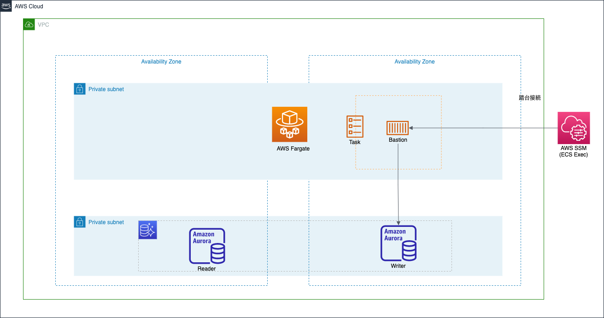

# FargateによるBastion(踏み台ホスト)の構築

## 　構成

踏み台を構成するにあたり、以下2パターンを構築します

### 構成1



- Fargateのタスクを立ち上げて、踏み台として利用するパターン
- FargateにはECS Execの機能を利用して接続する
  - https://docs.aws.amazon.com/ja_jp/AmazonECS/latest/userguide/ecs-exec.html
- NATGateWayは利用していないため、プライベートサブネットで利用できるように各種VPCエンドポイントを作成する

この構成のメリット

- Fargateで構成しているため、OS以下のレイヤーの管理が不要
  - 踏み台マシンの脆弱性管理の範囲がぐっと狭くなる
- ssh用のポート穴あけも不要でセキュアな点が多い
  - CloudTrailsに監査用のログも残る
- シェルスクリプトを用意しているため、手軽に実行できる

この構成のデメリット

- DB接続において、sshトンネリングで TablePlusなどのDBクライアントでDB接続する要件がある場合に辛い
  - 結局sshをインストールして〜トンネリングするために〜とか考えることが多くなる？

DBクライアントを用いた接続などの要件がなければ、この構成のメリットは大きい。

管理者的観点ではこちらの方を極力使いたい

### 構成2

WIP

## 手順

### 事前準備

### globalリソース群の作成

今回はECRを作成して、イメージのプッシュまで行う。

```bash
cd infra/global
terraform init
terraform plan
terraform apply
```

### productionリソース群の作成

今回は本番環境を想定して、productionというディレクトリ名にしている。
（他、developmentやstagingなど環境ごとに作成されるイメージ)


```bash
cd ../production
terraform init
terraform plan
terraform apply
```

## ローカルからの実行

```bash
# タスクをCLIで起動
 ./run_task.sh prd
# task_idが出力されればOK
# 出力されたタスクIDを第2引数に渡す
./ecs_exec.sh prd ${TASKのID}
```

以下のように出力されればセッション開始

```
The Session Manager plugin was installed successfully. Use the AWS CLI to start a session.
Starting session with SessionId: ecs-execute-command-
```

RDSに接続する場合は、以下のようにシェルスクリプトを実行する

```bash
mysql -h ${RDSのライターのエンドポイント} -u root -p
> Terraformで設定したパスワードを入力する
```

